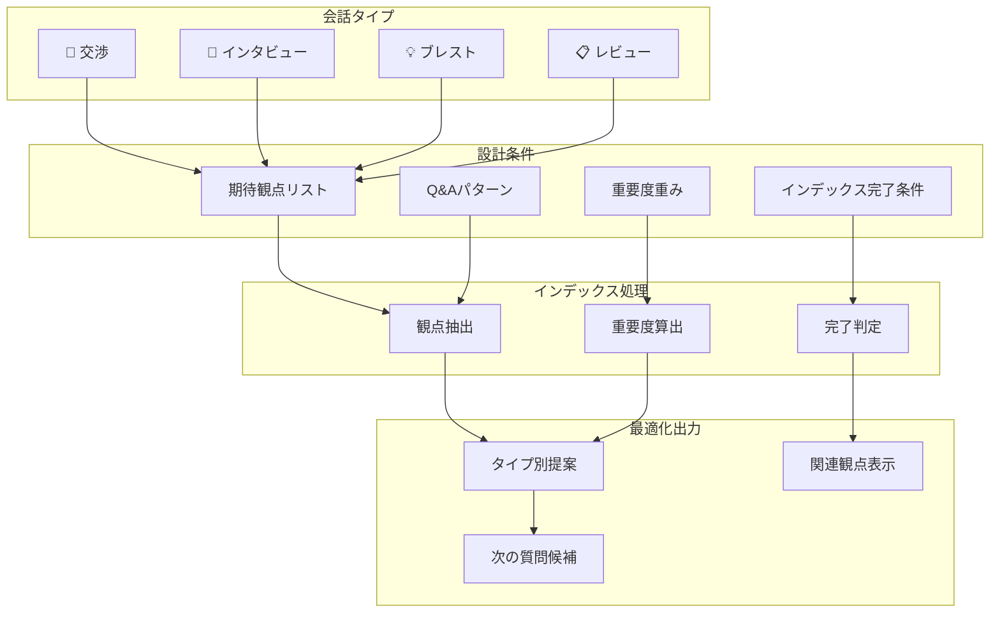
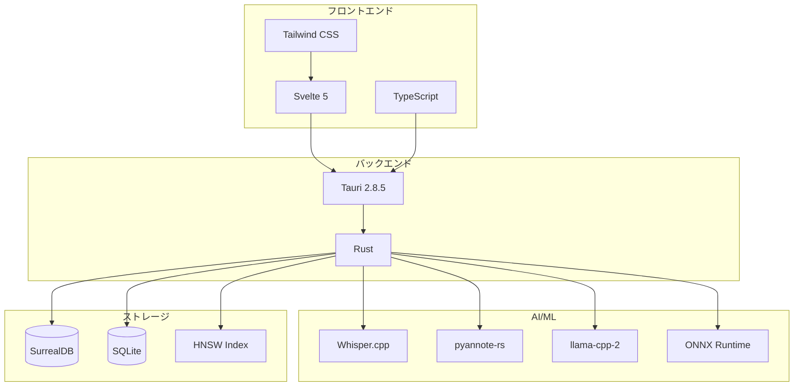

# CheatPaper アーキテクチャ図 (Mermaid版)

以下のMermaidコードをMermaid対応エディタやMarkdownプレビューで表示してください。

## システム全体図

```mermaid
flowchart TB
    subgraph Input["🎤 音声入力レイヤー"]
        MIC[マイク入力]
        SYS[システム音声]
        DOC[参照資料 PDF]
    end

    subgraph Process["⚙️ 音声処理レイヤー"]
        WHI[Whisper.cpp<br/>音声認識 500MB]
        PYA[pyannote-rs<br/>話者分離]
    end

    subgraph RAG["🧠 インテリジェントRAGレイヤー"]
        subgraph Graph["GraphRAG"]
            LR[LightRAG]
            SDB[(SurrealDB)]
        end
        subgraph Index["設計条件インデックス"]
            CT[会話タイプ定義]
            VP[期待観点]
            QA[Q&Aパターン]
        end
        subgraph Search["ハイブリッド検索"]
            SQL[(SQLite FTS5)]
            VEC[HNSW ベクトル]
            EMB[multilingual-e5-base<br/>768次元]
        end
    end

    subgraph LLM["💜 ローカルLLM"]
        QW[Qwen 2.5 7B<br/>llama.cpp<br/>8192 tokens]
    end

    subgraph Output["✅ 出力"]
        SUG[💡 リアルタイムAI提案]
    end

    MIC --> WHI
    SYS --> WHI
    WHI --> PYA
    PYA --> LR
    DOC --> SQL
    DOC --> EMB

    LR <--> SDB
    CT --> LR
    VP --> CT
    QA --> CT

    EMB --> VEC
    SQL <--> VEC
    LR --> QW
    VEC --> QW
    QW --> SUG

    style Input fill:#0f3460,stroke:#00d9ff
    style Process fill:#c73659,stroke:#e94560
    style RAG fill:#0099cc,stroke:#00d9ff
    style LLM fill:#5b21b6,stroke:#7c3aed
    style Output fill:#059669,stroke:#10b981
```

## データフロー詳細

```mermaid
flowchart LR
    subgraph Stage1["Stage 1: 入力"]
        A1[🎤 音声] --> B1[PCM 16kHz]
        A2[📄 PDF] --> B2[テキスト抽出]
    end

    subgraph Stage2["Stage 2: 処理"]
        B1 --> C1[Whisper 認識]
        C1 --> C2[話者識別]
        B2 --> C3[チャンク分割]
    end

    subgraph Stage3["Stage 3: 索引"]
        C2 --> D1[エンティティ抽出]
        D1 --> D2[関係グラフ構築]
        C3 --> D3[埋め込み生成]
        D3 --> D4[HNSW登録]
    end

    subgraph Stage4["Stage 4: 検索"]
        D2 --> E1[グラフ走査]
        D4 --> E2[類似検索]
        E1 --> E3[ハイブリッドリランク]
        E2 --> E3
    end

    subgraph Stage5["Stage 5: 生成"]
        E3 --> F1[コンテキスト構築]
        F1 --> F2[LLM推論]
        F2 --> F3[提案生成]
    end

    style Stage1 fill:#1a1a2e
    style Stage2 fill:#e94560
    style Stage3 fill:#00d9ff
    style Stage4 fill:#7c3aed
    style Stage5 fill:#10b981
```

## 会話タイプ別フロー

## 技術スタック

## メトリクス比較

```mermaid
xychart-beta
    title "GraphRAG vs 従来RAG パフォーマンス比較"
    x-axis ["クエリ精度", "応答完全性", "文脈保持", "トークン効率(log)"]
    y-axis "スコア (%)" 0 --> 100
    bar "従来RAG" [23, 67, 34, 0.017]
    bar "GraphRAG" [87, 94, 91, 100]
```

---

## 使用方法

1. **GitHub/GitLab**: このファイルをそのままプッシュすると自動レンダリング
2. **VSCode**: Markdown Preview Mermaid Support 拡張機能を使用
3. **Notion**: /code ブロックでmermaidを選択
4. **オンライン**: https://mermaid.live/ にコードを貼り付け
5. **Obsidian**: ネイティブでMermaidをサポート

## SVG出力

高解像度画像が必要な場合は `ARCHITECTURE_DIAGRAM.svg` を使用してください。
